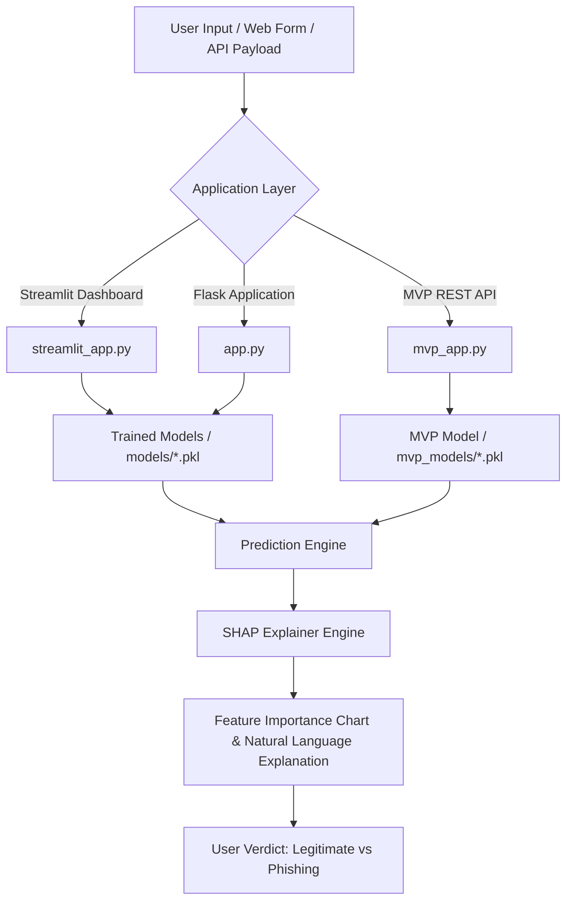

# 🛡️ Phishing AI Detector

[](https://www.python.org/)
[](https://flask.palletsprojects.com/)
[](https://streamlit.io/)
[](LICENSE)
[](.github/workflows/ci.yml)

An end-to-end Machine Learning & Explainable AI (XAI) security system for detecting **Phishing Websites**. Built with multiple classification models (Random Forest, XGBoost, Logistic Regression), SHAP feature attribution explainability, and multi-interface deployment options (Streamlit Dashboard, Flask Web App, and REST JSON API).

---

## 🌟 Key Features

* 🤖 **Multi-Model Machine Learning Suite**: Integrates Random Forest (~96.7% accuracy), XGBoost, and Logistic Regression models trained on 11,000+ domain and URL security parameters.
* 🧠 **Explainable AI (XAI) with SHAP**: Provides transparent, visual feature-attribution breakdowns and natural language explanations for every prediction decision.
* 📊 **Interactive Streamlit Dashboard**: Live model metrics comparison (Precision, Recall, F1-Score) and interactive security feature forms.
* 🌐 **Production-Ready Flask Web Application**: Clean form-based predictions using Jinja2 templates, XSS sanitization, and isolated asset rendering.
* 🚀 **MVP & REST API Endpoint**: Lightweight 10-feature API endpoint (`POST /api/predict`) designed for third-party system integration and quick assessments.
* 🔒 **Production Hardened**: Localhost isolation, safe secret handling, dynamic asset management, and comprehensive unit tests.

---

## 🏗️ System Architecture



---

## 📁 Repository Structure

```
phishing-ai-detector/
├── .github/
│   └── workflows/
│       └── ci.yml             # GitHub Actions CI Pipeline
├── data/
│   └── phishing.csv           # Phishing dataset (11,056 rows x 30 features)
├── metrics/                   # Classification report metrics in JSON
│   ├── metrics_lr.json
│   ├── metrics_rf.json
│   └── metrics_xgb.json
├── models/                    # Serialized full pipeline models
│   ├── phishing_model_best.pkl
│   ├── phishing_model_lr.pkl
│   ├── phishing_model_rf.pkl
│   └── phishing_model_xgb.pkl
├── mvp_models/                # Serialized MVP models (10 key features)
├── notebooks/                 # Exploratory Data Analysis & comparisons
│   ├── Compare_Models.ipynb
│   └── Phishing_EDA.ipynb
├── static/                    # Dynamic SHAP plot storage
├── templates/                 # Jinja2 HTML templates for Flask
│   ├── form.html
│   └── result.html
├── tests/                     # Automated unit tests
│   └── test_app.py
├── app.py                     # Main Flask Application
├── demo_app.py                # Standalone GUI demo
├── mvp_app.py                 # MVP Flask application & JSON API
├── mvp_train.py               # MVP model training script
├── streamlit_app.py           # Streamlit Interactive Dashboard
├── train_and_evaluate_all_models.py # Full pipeline training script
├── requirements.txt           # Python dependencies
├── .env.example               # Environment variables template
├── .gitignore                 # Git ignore configuration
├── CONTRIBUTING.md            # Contribution guidelines
├── LICENSE                    # MIT License
└── SECURITY.md                # Security policy
```

---

## 🚀 Quick Start

### 1. Prerequisites & Installation

Clone the repository and install requirements:

```bash
git clone https://github.com/azlan-ismail/phishing-ai-detector.git
cd phishing-ai-detector

python3 -m venv venv
source venv/bin/activate  # On Windows: venv\Scripts\activate

pip install -r requirements.txt
```

### 2. Model Training (Optional)

Pre-trained models are included in `models/`. To retrain models from scratch:

```bash
# Train full 30-feature models
python3 train_and_evaluate_all_models.py

# Train lightweight 10-feature MVP model
python3 mvp_train.py
```

---

## 💻 Running the Applications

### Option A: Streamlit Interactive Dashboard (Recommended)

Launch the interactive Streamlit UI with live SHAP visualizations and performance comparisons:

```bash
streamlit run streamlit_app.py
```
Open **`http://localhost:8501`** in your browser.

### Option B: Flask Web Application

Launch the standard web interface:

```bash
python3 app.py
```
Open **`http://localhost:5000/form`** in your browser.

### Option C: MVP Interface & REST API

Launch the 10-feature MVP app and JSON API server:

```bash
python3 mvp_app.py
```
Open **`http://localhost:5001`** in your browser.

---

## 🔌 REST API Documentation

### Endpoint: `POST /api/predict`

Submit website security features and receive a structured JSON prediction verdict.

#### Request Example:
```bash
curl -X POST http://localhost:5001/api/predict \
  -H "Content-Type: application/json" \
  -d '{
    "having_IP_Address": -1,
    "URL_Length": 1,
    "SSLfinal_State": -1,
    "Domain_registeration_length": -1,
    "age_of_domain": -1,
    "HTTPS_token": 1,
    "URL_of_Anchor": -1,
    "Abnormal_URL": -1,
    "Google_Index": 1,
    "Statistical_report": -1
  }'
```

#### Response Example:
```json
{
  "confidence": 0.967,
  "legitimate_probability": 0.033,
  "phishing_probability": 0.967,
  "prediction": 1,
  "result": "phishing",
  "timestamp": "2026-07-31T21:44:00.000000"
}
```

---

## 🧪 Running Unit Tests

Run the test suite to verify prediction correctness, route responses, and API contracts:

```bash
python3 -m unittest discover tests
```

---

## 🛡️ Security

This project enforces strict security practices:
* Localhost default binding (`127.0.0.1`).
* Parameterized Jinja2 template rendering to prevent Reflected XSS.
* Dynamic asset filenames (`uuid`) to prevent concurrent race condition collisions.
* No hardcoded production secret keys.

For detailed security guidelines, see [`SECURITY.md`](SECURITY.md).

---

## 📄 License

Distributed under the MIT License. See [`LICENSE`](LICENSE) for details.
